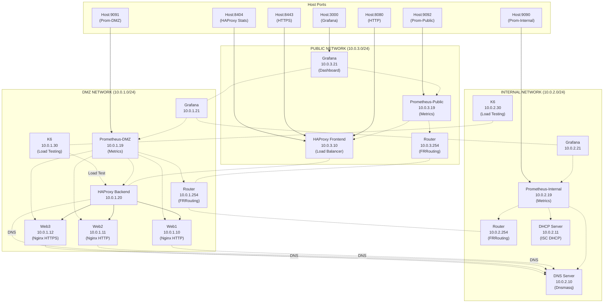
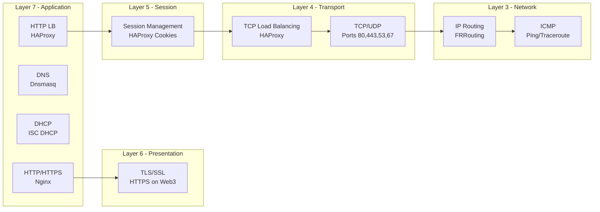
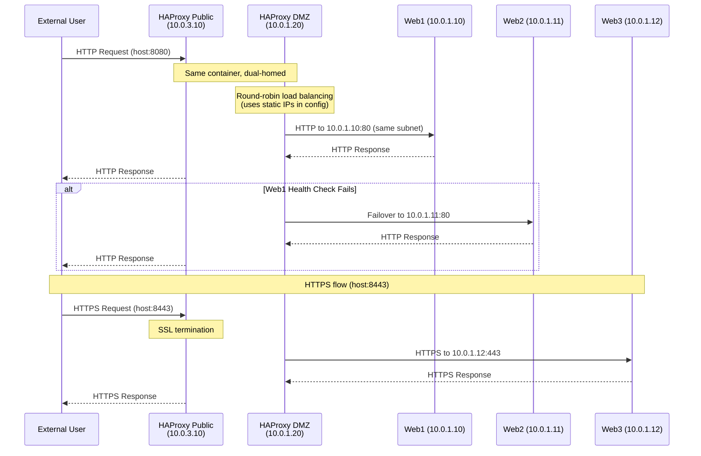
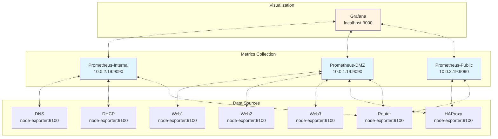
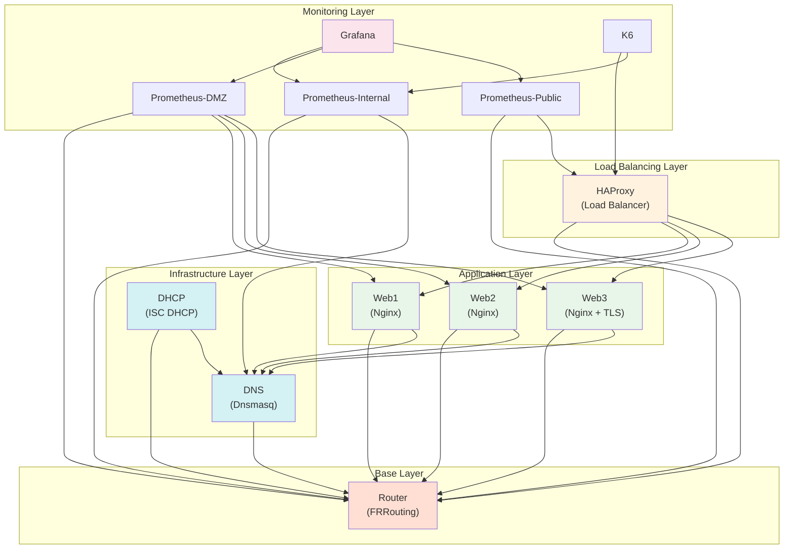
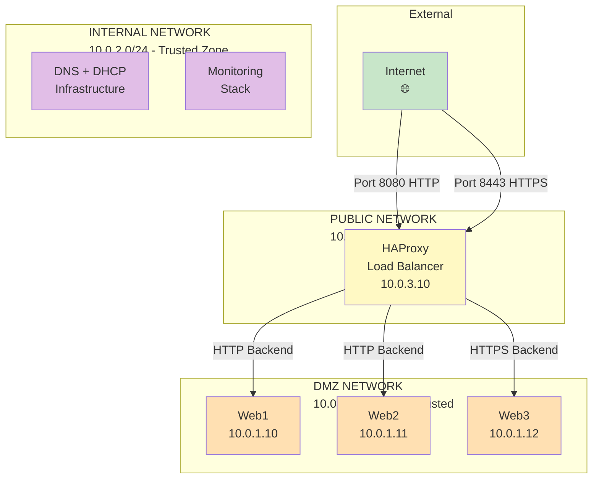

# Network Lab Architecture & Learning Guide

For setup, usage, and troubleshooting, see [README.md](README.md).

## System Architecture Diagram



## OSI Layer Breakdown



### Layer Details

#### Layer 3 - Network Layer
- **Component**: FRRouting router
- **What it does**: Routes packets between different network segments (DMZ, Internal, Public)
- **Test it**: `docker exec netlab-router vtysh -c "show ip route"`

#### Layer 4 - Transport Layer
- **Component**: HAProxy (TCP mode)
- **What it does**: Load balances TCP connections, manages sessions
- **Test it**: View HAProxy stats at http://localhost:8404/stats

#### Layer 5 - Session Layer
- **Component**: HAProxy session management
- **What it does**: Maintains persistent connections, cookie-based session affinity
- **Test it**: Notice SERVERID cookies in HAProxy config

#### Layer 6 - Presentation Layer
- **Components**: HTTPS/SSL termination at HAProxy, TLS on Web3
- **What it does**: Encryption, data format conversion
- **Test it**: `curl -k https://localhost:8443` or `./scripts/test_https.sh`

#### Layer 7 - Application Layer
- **Components**: HTTP servers, DNS, DHCP
- **What it does**: Application-specific protocols (HTTP, DNS, DHCP)
- **Test it**: `curl http://localhost:8080`

### OSI Model Reference

| Layer | Number | Name | Protocols | Lab Component |
|-------|--------|------|-----------|---------------|
| Application | 7 | Application | HTTP, DNS, DHCP | Nginx, Dnsmasq |
| Presentation | 6 | Presentation | SSL/TLS | HAProxy SSL, Web3 TLS |
| Session | 5 | Session | NetBIOS, RPC | HAProxy sessions |
| Transport | 4 | Transport | TCP, UDP | HAProxy |
| Network | 3 | Network | IP, ICMP, Routing | FRRouting |
| Data Link | 2 | Data Link | Ethernet, ARP | Docker networks |
| Physical | 1 | Physical | Physical medium | Host network |

## Data Flow Diagram



## Monitoring Architecture



### Why Three Prometheus Instances?

This lab uses a **network-segmented monitoring approach** with three separate Prometheus instances:

1. **Educational Value**: Demonstrates real-world network segmentation and security boundaries
2. **Network Isolation**: Each Prometheus can only monitor services in its own network segment
3. **Realistic Deployment**: Mirrors production environments with DMZ/Internal/Public zones
4. **Security Best Practice**: Limits blast radius if one network segment is compromised

### Configuration Files

Each Prometheus instance has its own configuration with **static targets**:

- [monitor/prometheus/prometheus-internal.yml](monitor/prometheus/prometheus-internal.yml)
- [monitor/prometheus/prometheus-dmz.yml](monitor/prometheus/prometheus-dmz.yml)
- [monitor/prometheus/prometheus-public.yml](monitor/prometheus/prometheus-public.yml)

### Grafana Integration

Grafana is connected to all three networks and aggregates data from all Prometheus instances:

- **Datasource UIDs**: `prometheus-internal`, `prometheus-dmz`, `prometheus-public`
- **Dashboard**: Queries all three datasources simultaneously
- **Panels**: Show metrics from all networks in unified views

## Service Dependency Graph



## Network Segmentation & Security



## Component Summary

| Component | IP Address(es) | Layer | Technology | Purpose |
|-----------|----------------|-------|------------|---------|
| Router | 10.0.1.254, 10.0.2.254, 10.0.3.254 | L3 | FRRouting | Inter-network routing |
| DNS | 10.0.2.10 | L7 | Dnsmasq | Name resolution |
| DHCP | 10.0.2.11 | L7 | ISC DHCP | IP address assignment |
| Web1 | 10.0.1.10 | L7 | Nginx | HTTP web server |
| Web2 | 10.0.1.11 | L7 | Nginx | HTTP web server |
| Web3 | 10.0.1.12 | L6/L7 | Nginx | HTTPS web server |
| HAProxy | 10.0.3.10, 10.0.1.20 | L4/L7 | HAProxy | Load balancing |
| Prometheus-Internal | 10.0.2.19 | - | Prometheus | Metrics (Internal) |
| Prometheus-DMZ | 10.0.1.19 | - | Prometheus | Metrics (DMZ) |
| Prometheus-Public | 10.0.3.19 | - | Prometheus | Metrics (Public) |
| Grafana | 10.0.2.21, 10.0.1.21, 10.0.3.21 | - | Grafana | Visualization |
| K6 | 10.0.2.30, 10.0.1.30 | - | K6 | Load testing |

## Port Mappings

| Host Port | Container | Service | Description |
|-----------|-----------|---------|-------------|
| 8080 | 80 | HAProxy | HTTP Load Balancer |
| 8443 | 443 | HAProxy | HTTPS (SSL termination) |
| 8404 | 8404 | HAProxy | Statistics page |
| 3000 | 3000 | Grafana | Dashboard UI |
| 9090 | 9090 | Prometheus-Internal | Metrics UI (Internal) |
| 9091 | 9090 | Prometheus-DMZ | Metrics UI (DMZ) |
| 9092 | 9090 | Prometheus-Public | Metrics UI (Public) |

## Learning Guide

### Experimentation Ideas

#### 1. Test Routing Behavior

Simulate network segmentation:

```bash
# Add a static route
docker exec netlab-router vtysh -c "configure terminal" -c "ip route 192.168.0.0/24 10.0.1.1"

# View routing table
docker exec netlab-router vtysh -c "show ip route"
```

#### 2. Simulate Server Failure

Test HAProxy failover:

```bash
# Stop web1
docker stop netlab-web1

# Make requests - they should all go to web2
for i in {1..5}; do curl -s http://localhost:8080/ | grep SERVER; done

# Restart web1
docker start netlab-web1
```

#### 3. Analyze DNS Queries

Monitor DNS traffic:

```bash
# Watch DNS logs in real-time
docker logs -f netlab-dns

# In another terminal, make DNS queries
docker exec netlab-haproxy nslookup web1.netlab.local 10.0.2.10
```

#### 4. Test Load Balancing Algorithms

Modify HAProxy configuration to test different algorithms:

```bash
# Edit haproxy/haproxy.cfg
# Change 'balance roundrobin' to 'balance leastconn' or 'balance source'

# Rebuild and restart
docker compose up -d --build haproxy
```

#### 5. Monitor Network Performance

Use Grafana to visualize performance:

1. Open http://localhost:3000
2. Create custom queries in Prometheus
3. Watch container CPU and memory usage under load
4. Generate load: `for i in {1..100}; do curl http://localhost:8080/ & done`

### Advanced Exercises

1. **Add a new web server** (web4):
   - Copy `web3/` directory as template
   - Add to `docker-compose.yml` with IP 10.0.1.13 in DMZ
   - Add to HAProxy backend pool in `haproxy/haproxy.cfg`
   - Add DNS entry in `dns/dnsmasq.conf`
   - Add Prometheus target in `monitor/prometheus/prometheus-dmz.yml`

2. **Create custom Grafana dashboards**:
   - Add panels for HAProxy metrics
   - Monitor DNS query rates
   - Track request distribution across web1/web2/web3

3. **Implement caching**:
   - Add Varnish or Nginx caching layer
   - Measure performance improvement with K6

4. **Network traffic analysis**:
   - Use tcpdump to capture packets
   - Analyze with Wireshark
   - Identify different protocol layers

5. **Run K6 load tests and analyze**:
   - Compare response times across test profiles
   - Monitor Grafana dashboards during load tests
   - Tune HAProxy and Nginx for better throughput

## Technology Reference

- **[FRRouting](https://frrouting.org/)**: Open-source routing software suite
- **[Dnsmasq](https://thekelleys.org.uk/dnsmasq/doc.html)**: Lightweight DNS/DHCP server
- **[HAProxy](https://www.haproxy.org/)**: High-performance TCP/HTTP load balancer
- **[Prometheus](https://prometheus.io/)**: Time-series metrics database
- **[Grafana](https://grafana.com/)**: Metrics visualization platform
- **[K6](https://k6.io/)**: Modern load testing tool